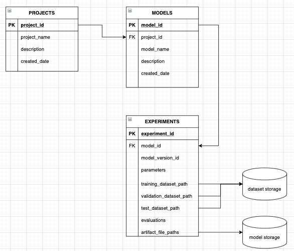
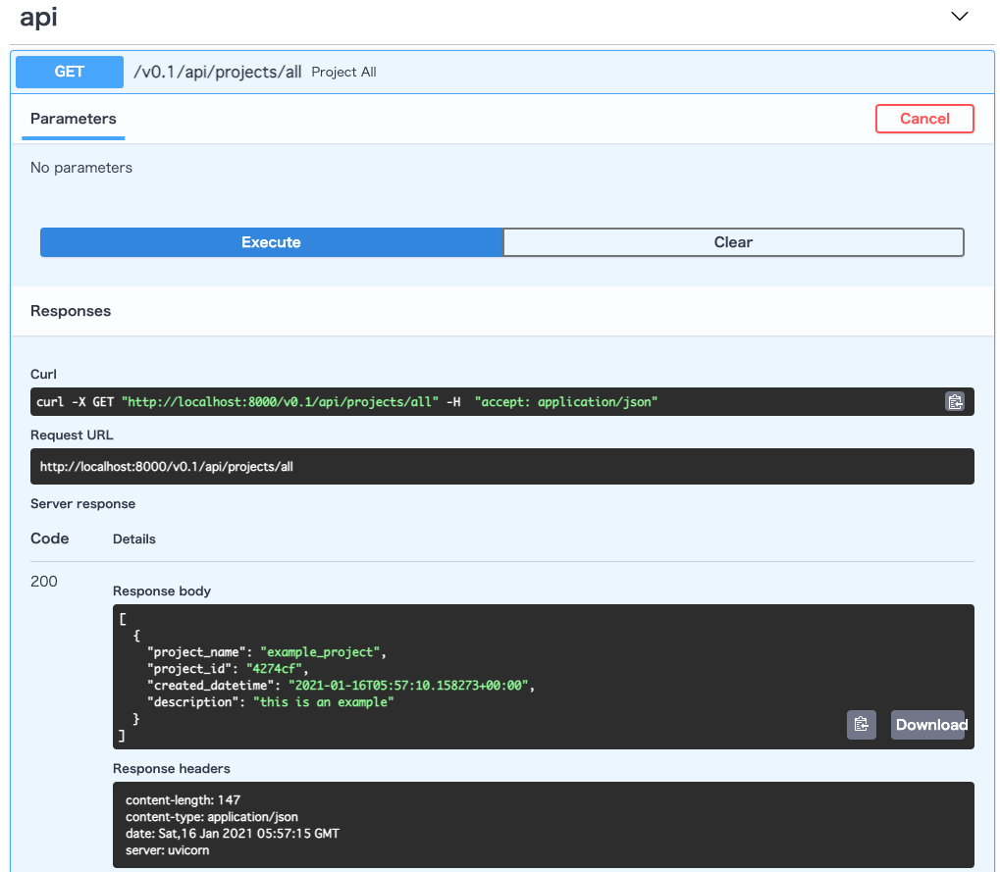

# モデル管理 DB

## 目的

モデルを管理するためのデータベースおよびサービス用 REST API を構築します。
本プログラムでは以下のような構成のモデル管理サービスを作ります。



## 前提

- Python 3.8 以上
- Docker
- Docker compose

## テーブル構成
参照: [https://github.com/kooose38/model-db-/blob/master/model_db/src/db/models.py](https://github.com/kooose38/model-db-/blob/master/model_db/src/db/models.py)

#### Project 
プロジェクト名のテーブル
| column | Description |
| ------:| -----------:|
| project_id   | プロジェクトID (primary Key) |
| project_name | プロジェクト名 |

#### Model 
モデル管理テーブル
| column | Description |
| ------:| -----------:|
| model_id | モデルのID (primary key)|
| model_name | モデルの名前 一意 |
| project_id | 上に同じ |
| project_name | 上に同じ |
| description    | 概要 |

#### Experiment
実験管理テーブル
| column | Description |
| ------:| -----------:|
| experiment_id | 実験ID (primary key) |
| model_id | 上に同じ |
| model_version_id | モデル毎のバージョン名 |
| parameters | モデルのパラメータ |
| training_dataset | 訓練データのパス |
| validation_dataset | 検証データのパス |
| test_dataset | テストデータのパス |
| evaluations | 検証結果 |
| artifact_file_paths | モデルのパス |


## 使い方

1. `aws`のインスタンスの立ち上げ

2. サーバーの立ち上げ
```
  $ cd ./model_db/model_db
  $ make c_up 
  CONTAINER ID   IMAGE                                        COMMAND                  CREATED         STATUS         PORTS                                       NAMES
a1f4d1b004cb   kooose/ml-system-in-actions:model_db_0.0.1   "./run.sh"               2 minutes ago   Up 2 minutes   0.0.0.0:8000->8000/tcp, :::8000->8000/tcp   model_db
d1d2865f0409   postgres:13.3                                "docker-entrypoint.s…"   2 minutes ago   Up 2 minutes   0.0.0.0:5432->5432/tcp, :::5432->5432/tcp   postgres
```

3. `http:\\<aws-public-ip>:8000/docs`でアクセスする  

  


4. シャットダウンする
```
  $ make c_down 
  docker-compose \
        -f ./docker-compose.yml \
        down
   Stopping model_db ... done
   Stopping postgres ... done
   Removing model_db ... done
   Removing postgres ... done
   Removing network model_db_default

```